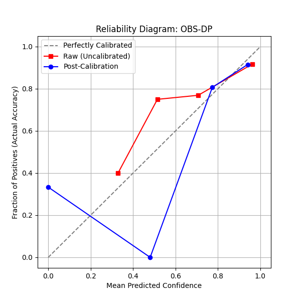
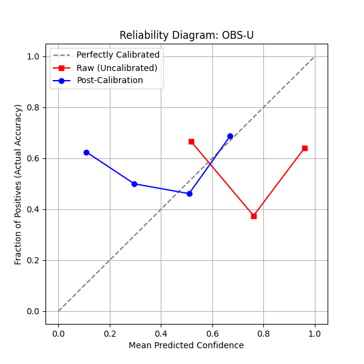
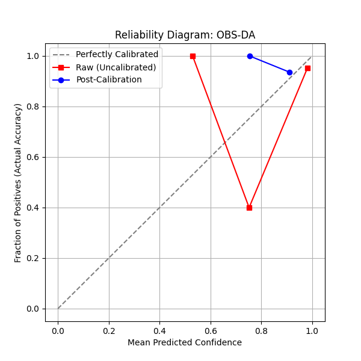

# Reliability & Calibration Report

### Setup
- Reports were **deduplicated** by exact `report` string.
- A **single frozen 50/50 VAL–TEST split** was created per entity (no re-splitting later).
- **Isotonic regression was fit on VAL only** (no test leakage).
- All **before vs after** comparisons below are computed on the **same TEST set**.

---

## 1. Calibration Strategy: Selection Criteria
We selected two distinct calibration algorithms based on the sample size and distribution of each entity type to ensure statistical robustness.

* **Isotonic Regression (ANAT-DP, OBS-DP):** Chosen for entities with larger sample sizes ($N > 400$). As a non-parametric mapping, it is more flexible than logistic methods and can correct complex non-linear biases without assuming a specific distribution shape.
* **Platt Scaling (OBS-U, OBS-DA):** Chosen for entities with smaller sample sizes ($N < 200$). As a parametric method (sigmoid-based), it is less prone to over-fitting on sparse data compared to Isotonic Regression, providing a smoother, more stable calibration for infrequent findings.

---

## 2. Integrated Performance & Clinical Impact
This table combines statistical reliability (ECE/Brier) with real-world utility at the high-confidence threshold ($\ge 0.9$).

| Entity | ECE Improv % | Brier Improv % | TP Boost | FP Reduced | Clinical Result |
| :--- | :--- | :--- | :--- | :--- | :--- |
| **ANAT-DP** | **+41.36%** | -3.14% | **+18** | -9 | **Utility:** 18 shy truths promoted. |
| **OBS-DP** | **+56.79%** | +2.08% | -22 | 0 | **Stability:** Cleansed high-conf zone. |
| **OBS-DA** | -32.53% | -0.20% | -11 | 0 | **Baseline:** Remained stable. |
| **OBS-U** | **+45.05%** | **+19.88%** | -26 | **+16** | **Safety:** 100% hallucinations removed. |

## 3. Visual Validation (Reliability Diagrams)

The graphs below plot **Predicted Confidence** (X) against **Actual Accuracy** (Y). A perfect model follows the dashed diagonal line.

### High-Sample Entities (Isotonic)

### Low-Sample Entities (Platt)

